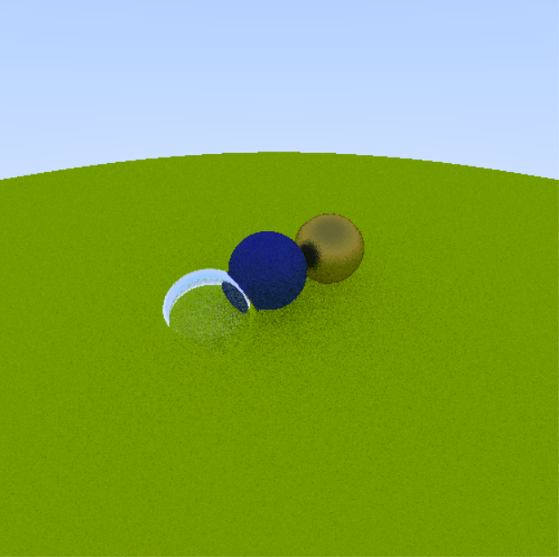

# Pytracer
Python/PyGame raytracer based on the book [Ray Tracing in One Weekend](https://raytracing.github.io/books/RayTracingInOneWeekend.html).

## Installing
This was made with Python 3.6.1 and PyGame 1.9.4.
You can use `pip` to install PyGame using the `requirements.txt` file in the repo with:
`pip install -r requirements.txt`

## Running
Run `python -m pytracer` from the root of the module to render the scene.
You should see a live-rendering of the scene depicted in the above image.

Press `Esc` at any time to quit out of the program.
Press `Space` at any time to re-render the scene.

## References
These are the guides I followed to perform the various arithmetic/renderings shown in the source code.

This is simply a Python/PyGame variation of the 'Ray Tracing in One Weekend' book with ray-sphere hit
calculations described in two of the other articles.

PyGame docs were used to reference the Vector and Scene API provided by PyGame.

- [Calculating Ray-Sphere Intersections](https://youtu.be/HFPlKQGChpE?si=YXX-EGaqQijDr4oE)
- [Pygame Front Page](https://www.pygame.org/docs/)
- [Ray-Sphere Intersection with Simple Math](https://kylehalladay.com/blog/tutorial/math/2013/12/24/Ray-Sphere-Intersection.html)
- [_Ray Tracing in One Weekend_](https://raytracing.github.io/books/RayTracingInOneWeekend.html)

## License
Pytracer is licensed under the Apache license version 2.
See the [LICENSE](https://github.com/Kingcitaldo125/Pytracer/blob/main/LICENSE) file for more details.
